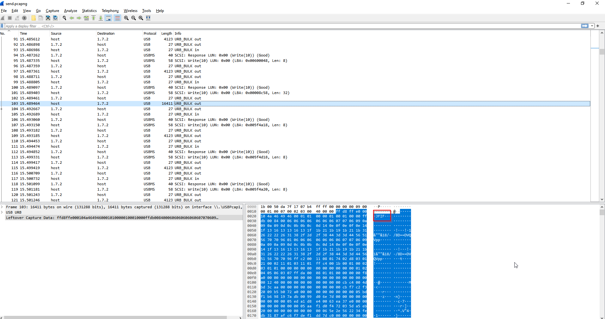

#### Description:

In a shocking turn of events, a malicious actor managed to gain physical access to our victim's computer by plugging in a rogue USB device. As a result, all critical data has been pilfered from the system. Flag is direct without BHFlagY{} tag.

##### Solution:

opening the wireshark, we observe multiple files are transferred, most of which are JPEG images

Arranging the the packets by length

We find a `winPE` file which is likely to contain the flag

Copy the value 

Using [CyberChef](https://gchq.github.io/CyberChef/) to convert it into .exe

Running the Executable

##### Flag:
BHflagy{1d3cbfa0e052b1729a00950e9fc0f61a3f393bc97c0c74c8ecab1b58cd0f95c32e4c970bdfa6e23371d50680ca0c37f61f7206974d20d5cbb2f00151f4735dde}
